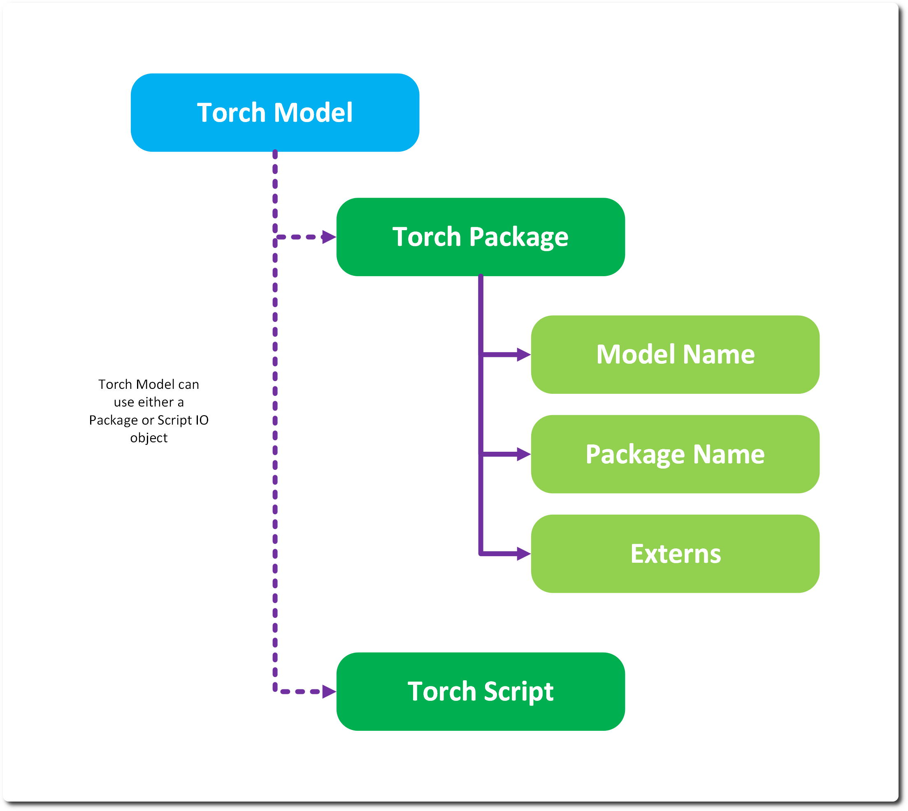
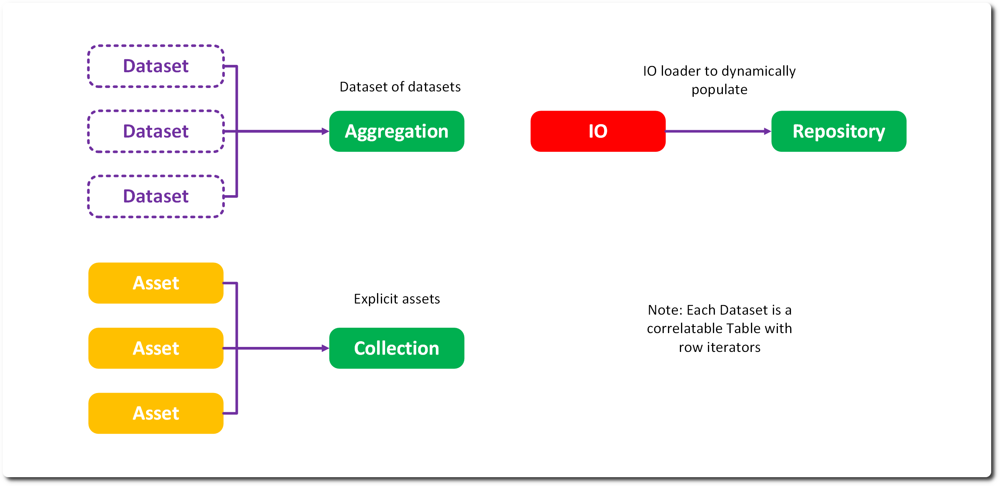
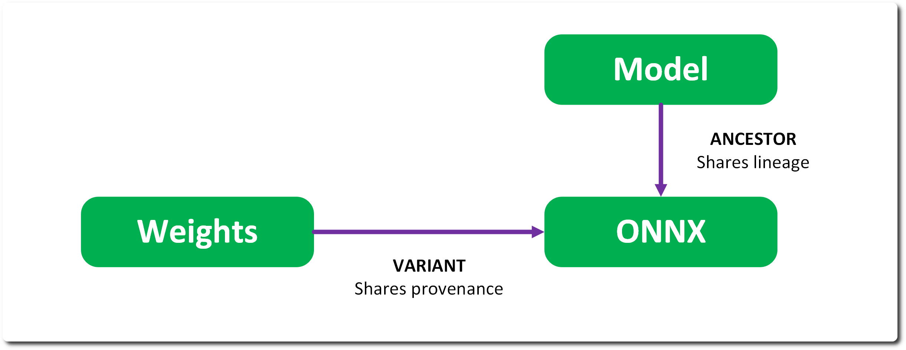
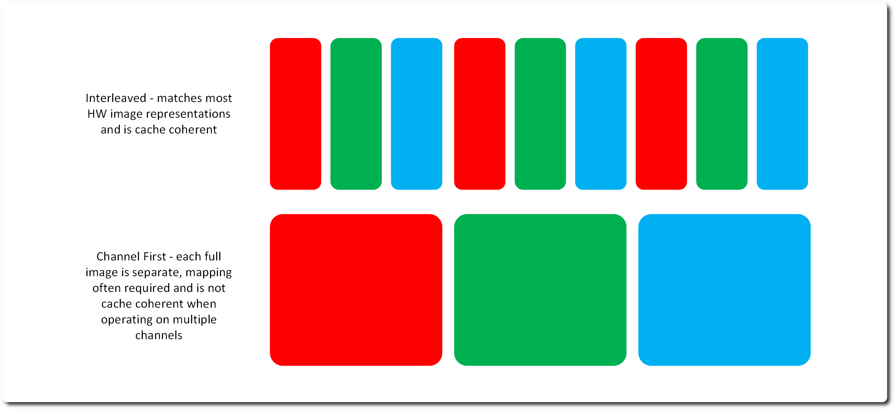

# Artifacts 

Artifacts are inferable and trainable entities. They each own a URI location and a way to read and write from that location. They are licensed and permissioned. They are concrete and are created when a client wants to do actual work within RMTC. 

Artifacts are not tied to specific formats – e.g. PyTorch or Keras, RMTC Core provides a PyTorch implementation, but this is easily replaceable. 

## URIs & IO 

An artifact has a binary representation stored at the URI location – however an artifact doesn’t manage how to read and write from that location, this is deferred to an IO instance. This means we can divorce how a model is stored from its functional representation. For example, a Torch model can be stored as a TorchScript model, a Package or even a class and converting between them is a simple matter of changing the IO structure. 



When we publish an asset, its URI is altered to the asset manager’s URI which is then used to transform back into a URI the IO system can operate on. It is possible to create variant artifacts when you publish and change the IO system to something specific to the asset manager – for example Open Asset IO implementations. 

## Assets 

Assets are the concrete VFX resource types that an Artifact’s IO reads and writes into memory – Values, Labels, Images, Meshes, Cameras and so on – rather than reusing an existing ML framework’s tensor conventions directly. 

Layouts are chosen to match how a GPU, DCC or game engine would hold the data, not how a research paper or PyTorch would represent it – for example Images are stored WHC RGBA rather than the more conventional CHW. This is deliberate, to keep the door open for memory mapped, C++ style real time inference later. 

We don’t support arbitrary lists of assets – only 2D datasets – so a list of inputs has to be represented as a single asset type rather than a Python list. Every singular asset (Value, Label, Mesh) has a plural counterpart (Values, Labels, Meshes) representing an arrayed version of the same structure; you can always use the plural form and treat a length of 1 the same as the singular case. 

Value and Label assets additionally support the Pod interface – a simple get/set pair – so the singular form can be treated as a basic parameter when marshalling to and from a model, without needing the full tensor machinery. 

Built-in asset types include Value/Values, Label/Labels, Image, Mesh, Camera, Skeleton, Pose and Transform. Structure exists as a base for composing an asset out of named member assets rather than a raw tensor. 

## Licenses & Guardrails 

Every artifact has a license – this is a persistent and shared Entity with a set of permissions. The permissions are a simple set of objects and will form the basis of the training and inferencing guardrails – if a process requires a permission (e.g. a face swap) but the licence isn’t granting that permission, the inference will fail. 

Licenses form the terminus for any provenance trace – essentially telling you where data has come from. 

Licenses are not vetted for fit for purpose and are only indicative. 

## Dataset Types 

Datasets are the base atomic unit for inference and training – as part of the data minimisation strategy we don’t go further in general into asset sets. 

Additionally – datasets are immutable, once created they cannot be changed, otherwise you will undermine the provenance of derived artifacts. 

The primary dataset is a repository – which allows the dataset to use an IO object to populate dynamically its entries. Repositories are like any other Artifact – they are required to be read, written and reset. An example Dataset IO we have is the interleaved image folder IO that loads each alternative EXR in a folder as a source and destination correlate that can be read through the Dataset’s table iterator. 

The second kind is an aggregation, which is a collection of datasets – this is how you tweak a dataset entry – by creating an aggregation of an existing dataset and a new dataset. Iterating through this dataset is one dimensional. 

The final type is collection – which is an explicit collection for asset references. This isn’t common, we want to avoid explicit assets due to storage and retrieval scaling issues. Again, iterating through this dataset is one dimensional. 



For similar reasons inferences don’t store the assets they create, but a dataset inference. We imagine a DCC executing many real-time inferences, then writing out an entry to reference the resulting assets collectively at the end of the DCC session rather than every instance of those inferences. 

General dataset definition is out of the scope of RMTC – we assume they are fully definable by URI. 

## Ancestors & Variants 

Every artifact can have a connection to something it came from – e.g. a source model or a variant which is an artifact derivation of this entity. 

These relationships differ in a critical way – ancestors do not share the same provenance, variants do. A variant is considered provenance equivalent (the same sources) but in a differing format – e.g. a ONNX variant of a PyTorch model. An ancestor is a source for a given artifact, but the artifact may have additional sources which means its provenance is not equivalent. 



## Metrics 

Trained Artifacts store metrics – Runs, Weights, Checkpoints & Models – as well as Inferences that derive from them. Metrics can be defined on ingestion for external models. 

This metric is assigned during training and is a normalized 0-1 value. Ideally from a validation dataset (not yet supported). 

Metrics are how we select best run – given a solution, find the best completed run with the lowest metric. 

## Tensor Formats 

One issue with AI is the various standards of asset and tensor formats. We try and insulate the models and assets using standardized internal representations.  

For tensors we use NumPy – not ideal as CPU specific and should be replaced. Assets store their tensors as volatile NumPy tensors on read via their IO object. 

Each asset has a particular RMTC format – for Images we use 1HWC RGBA. This is to align with future memory mapping. For meshes we intend to adopt a Vulcan mappable structure. 

For example consider an interleaved RGB image format vs a planar RGB image:


 
When we go to infer we need to convert that standard representation to a model specific representation e.g. BCHW for PyTorch image inferencing – this is where processors come in. 

## Processors

A processor is an invertible operation that converts the tensors to another format. These differ to PyTorch transforms as they can operate in 2 directions – taking an asset to a model input or output format and back. 

Every processor has a ```run``` and ```run_inverse``` method which should mirror each other - sometimes this is not possible when information is lost in one of the directions. Each processor has a specific tensor input and output shape to allow for runtime checking, though this is often bypassed at the minute.

The key processors that exist:
* Process - the base class
* Process Stack - an ordered list of operations, the result of one passed to the next - is invertable
* Process Inverse - inverts the operations

Note - that we generally don't deal with tensor batches in RMTC - the system passes lists of assets and the trainer runs the batching by collating into lists. A processor specifically collates this list of tensors into a single batch - for immediate passing into a model.

We currently have a number of basic operations:
* Agument - rotation, flip, scale, translate augmentation operations
* Channel - Image channel operations like remove alpha, channel reordering
* Structure - basic tensor operations like bath and flatten
* Color - normalisation operations

Processors are also used as a preprocess during training for augmentation (e.g. randomized resizing) and post inference processing – image normalisation etc. 

## Packager 

Where a Processor transforms tensors into other tensors without changing the sample structure, a Packager takes the full structured data block – a list of samples, each a tuple of per-asset tensors – and marshals it into whatever shape a specific model actually needs, e.g. a dict of batched tensors, a single padded tensor, or an arbitrary non-tensor structure. 

This split exists so tensor level operations (resize, normalise, augment) stay reusable via Processors, while the model specific plumbing (batching, stacking, dict vs tuple inputs) is isolated in a Packager – avoiding a proliferation of one-off per-model wrapper classes. Systems like PyTorch don’t formalise model inputs and outputs, so a Packager is deliberately unconstrained about what it returns. 

Packagers are chainable like Processors – PackagerStack runs a list of them in order and reverses that order for run_inverse. ProcessPackager combines the two – running a set of index-aligned Processors over each asset in a sample before handing the result to a wrapped Packager. 

This is the mechanism the DCC Inference process stack (see Infer, below) is built on – a real time process stack for a model is really a chained combination of Processors and a Packager tailored to that model or DCC context. 

## Models, Weights & Checkpoints 

Within RMTC we make the distinction between these 3 items – Weights are paired with Models, a model is duplicated then the weights loaded, to ensure we could have multiple models in memory with separate weights.  

Checkpoints are intended to store additional training information to ensure we can restart training exactly as it was left off – Weights should strip that information down to only what is needed for inference. 

In the case of inferable only models – e.g. ONNX, we create it as a variant of the Weights object during the pipeline build and mark it as an ancestor of the source model.

---
SPDX-License-Identifier: Apache-2.0 - Copyright Contributors to the RMTC Project
