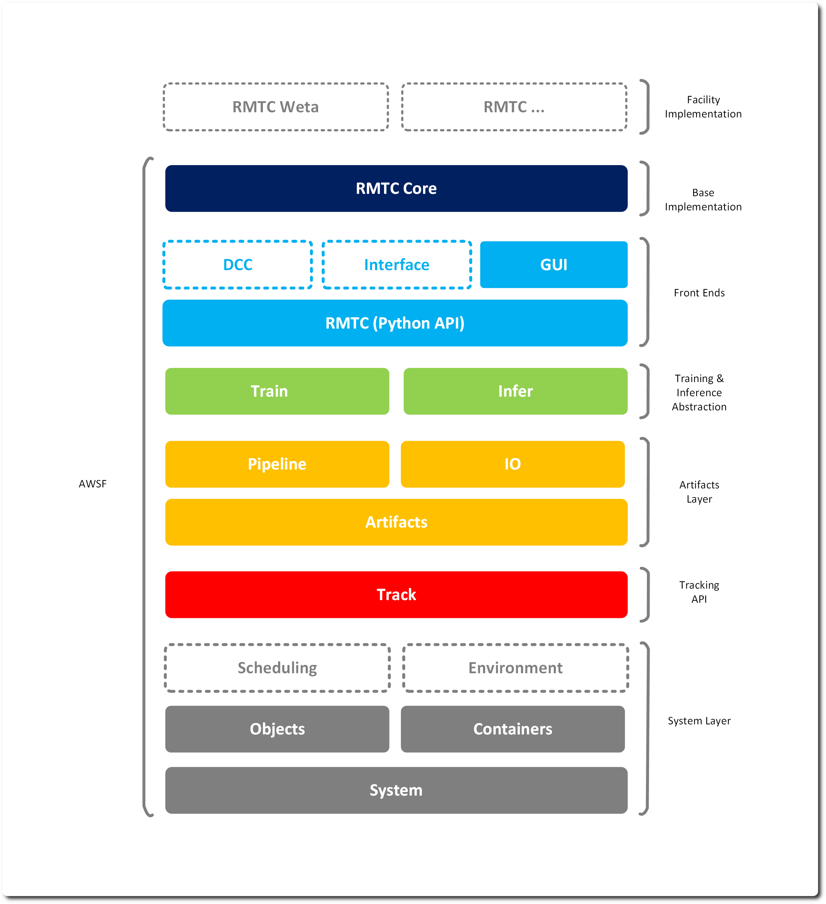
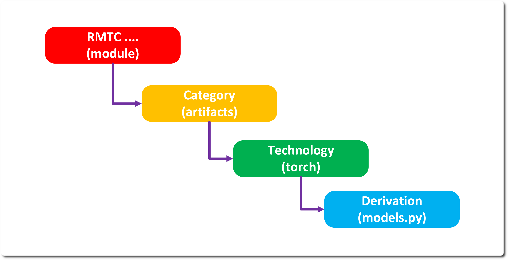

# Code Structure 

RMTC is currently a set of Python modules split into 3 main modules: 
* RMTC – general systems and abstractions 
* RMTC Core – specific extensions to RMTC 
* RMTC GUI – the Qt based tooling built on top of the above 
There is also a ‘bin’ folder holding the thin command line entry points (rmtcgui, rmtcexplorer etc.) that launch the GUI module. 

## The Sandwich 

## RMTC vs RMTC Core 

The division between RMTC & RMTC Core is fuzzy, with the general rule that technology specific extensions (OIIO, TensorBoard, PyTorch etc.) are contained within RMTC Core as well as any systems that would expect to be overridden by each facility – for example the Asset Management pipelines. 

The code is generally structured by technology, an RMTC Core submodule will contain each technology that extends RMTC as a subfolder for example to extend the model class in RMTC we would have a matching structure in RMTC Core that looks like this: 

## Testing 

Tests are split between integration and unit – which are a rough and somewhat inaccurate division. Unit contains basic tests that slowly build up and Integration contains more complex cross module tests. 

## Linting & Formatting 

Code is automatically formatted via Black so manual formatting is not a concern. A linting file for pylint is setup to assume a rating of 10.0. 

## Resources 

A res folder contains any of the none-code resources – config files, images and icons. These should be installed alongside the application with the RMTC_RESOURCES env var set.

---
SPDX-License-Identifier: Apache-2.0 - Copyright Contributors to the RMTC Project
