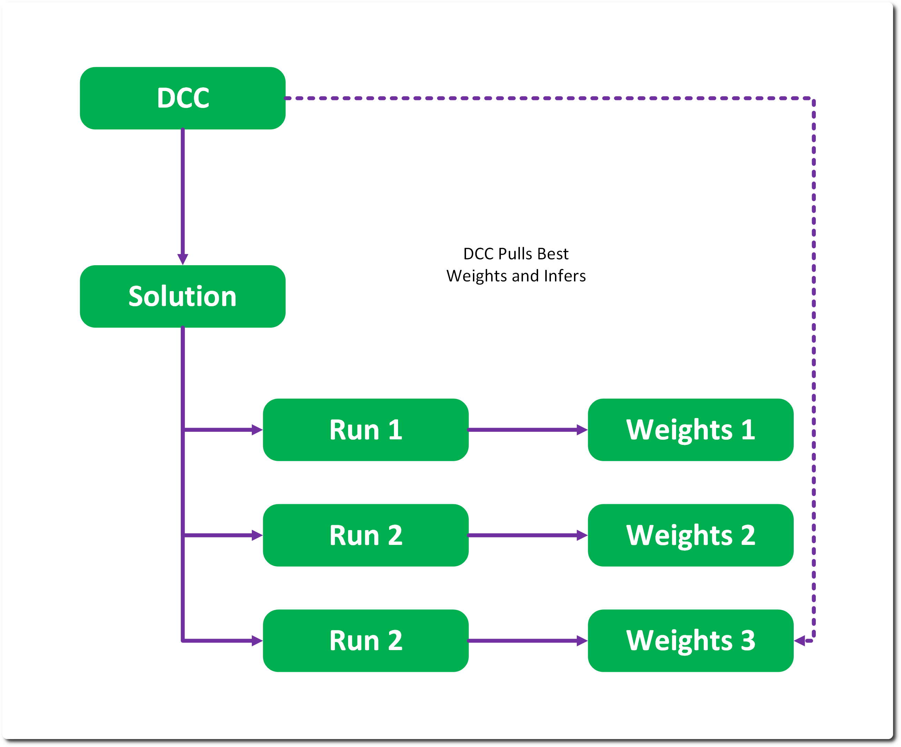

# Infer 

Inference is a lean module that wraps basic dataset to dataset inference. 

## Inferers 

An inferer generates an inference instance from a given dataset, weights and model. The resulting inference will refer to a new dynamically created dataset – which can be written out if required. The client can provide the type of dataset to populate, and the IO related to writing to the URI. 

DCC plugins would also be considered an inferer – inferers do not own the monopoly on creating inference. An inference can be constructed directly from System for any potential non-RMTC inference system. 

Inferers are not stored directly as they are in practice fungible – the model, weights, input and outputs are all recorded which should be enough to recreate any inference. 

The inferer is currently not scheduled, though this should be a future feature to add.  

## Inferencing & Datasets 

Inferences manage input and output datasets – they don’t generate lists of assets. This is an important part of data minimisation. 

The way in which labelling and annotation work in the inference system could be improved – RMTC assumes an Asset-to-Asset transformation in inference. For Values asset types it is an Asset-to-Asset Element transformation which is poorly managed – this can be seen in the MNIST example. This structure needs revisiting. 

## A Note on Performance 

The image tensor format is a HWC RGBA format, and the intended Mesh representation is a mappable Vulcan vertex format – this is non-standard to PyTorch/ImageNet. The motive here is to enable future memory mapping – channels last format is closer to the interleaved format often used in memory for DCCs and real time contexts. This is intentional and is there to encourage performant inferencing and faster training. 

## DCC Inference 

The idea is that a DCC or TD would refer to a solution in their pipeline rather than a model. RMTC would pull the best quality Run and execute the inference. This of course can be overridden to use specific models or weights as per the shot requires. 

The signature in such case would be used to setup the marshalling operations for the data from the DCC to RMTC formats. The model itself would have a process stack consisting of properties and type names of those processes - which would be instantiated into a real time process tack implementations for transformation of the data to the model format – ideally a limited memory mappable representation can be used.

---
SPDX-License-Identifier: Apache-2.0 - Copyright Contributors to the RMTC Project
