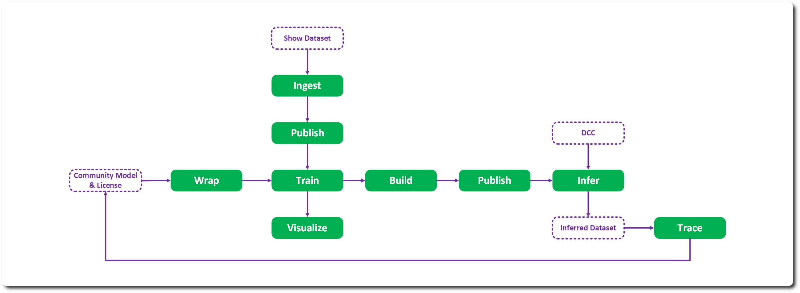

# Introduction 

RMTC is an AI artifact tracking, training & inferencing system developed initially by Wētā FX and open sourced under Apache-2.0 via The Academy Software Foundation. RMTC’s chief purpose is in managing AI artifact provenance to help protect artist and studio interests. 

The intent is allowing a facility to trace an inference, back up through all the steps to the source and any licenses 

## Project Status

RMTC is considered pre-Alpha, it has not been tested in production and is under active development. No warranty of any kind is provided – see Apache-2.0 license. 

## Document Purpose

This document follows a technical notes format on each of modules of the implementation to give you a sense of how RMTC works. 

It is the partner document to the initial develop branch release to the ASWF GitHub and is intended to be read alongside the code to provide insights into each of the modules, it is not class documentation – docstrings are present on almost all the Python classes. 

## Key Concepts 

### Provenance & Permissions

Artifacts are all attached to a license and permission system with object properties having provenance specific features for detailed tracing back to source. Permissions help control usage and access and are attached to the source licenses. 

### Immutability

To protect provenance and history – Artifacts in RMTC are immutable and should not be deleted. 

### Data Minimisation

RMTC strives to reduce the amount of data in the local system by using: 

* Just in time storage queries 
* Partially synced data 
* Reversed 1:1 relationships (rather than 1: Many) 

## VFX First

EXR, USD assets, DCC integration – show and pipeline concepts are all first-class citizens in the system. 

## Injection & Deferral 

Classes are intended to be injected into the system with significant amounts of deferral. The object hierarchy is relatively shallow, and classes are split into functional responsibilities – IO, inference, training etc. 

## Standardization 

Tensors & assets all follow a standard representation with last minute conversion to model types using processes owned by the model. Asset tensors standardize to optimal inference formats – e.g. HWC rather than CHW.

---
SPDX-License-Identifier: Apache-2.0 - Copyright Contributors to the RMTC Project
