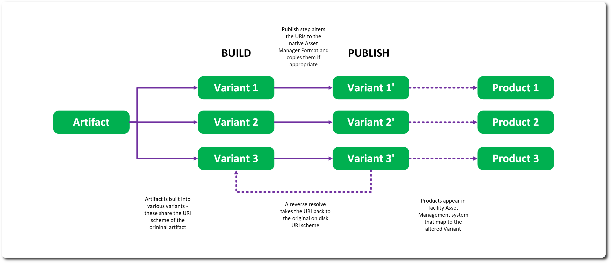

# Pipeline 

What sets RMTC apart from other ML/AI frameworks is the focus on VFX concepts such as pipelining. In the context of RMTC a pipeline refers to take an Artifact, building into a context specific format and publishing to an external asset management system. 

## Building 

RMTC allows for the transformation of artifacts using a set of per Artifact type builder. This can be selected by the client to run over a Model, Weights or Dataset and become a series of derived Artifacts – all marked as variants of the original Artifact.  

For example, a combination of Model and Weights files can be converted to a Torch script model and then a CAT file for Nuke execution. The two products marked as variants of the original Weights file and ancestors of the Model. 

Any unknown Artifacts in RMTC are exposed as ‘Resources’ - for example the Nuke CAT file. 

## Asset Management 

Artifacts are written and read through an asset manager which operates on transforming the associated URI to and from an Asset Manager specific URI. The scheme of the URI (“file” for example) can be used to key how to transform the URI. 

Publishing an asset passes it to the instantiated asset manager – the default is a simple filesystem manager and transforms the artifact URI. 

Asset Managers store the Artifact Builds - if one is defined then the builder is executed prior to publish so the built Artifact is the item that is published to the system. 

In addition, the IO object can be transformed by the publish step allowing a system to defer the Artifact IO to specialized per Asset Manager systems. 

## Publishers 

An asset manager delegates the actual publish mechanics to a Publisher – the abstraction that knows how to resolve URIs to and from the asset manager’s scheme, reserve a version, publish, unpublish and relocate entities, and report whether a set of entities is already published or immutable in this system. 

RMTC Core’s default is DiskPublisher, a simple filesystem-backed implementation – it only supports `file://localhost` URIs, reserves a version by taking the highest existing version folder and bumping the major, and treats publishing as essentially a no-op validation step since the entity is already at a resolvable path. Facilities are expected to provide their own Publisher for a real asset management system.

---
SPDX-License-Identifier: Apache-2.0 - Copyright Contributors to the RMTC Project
