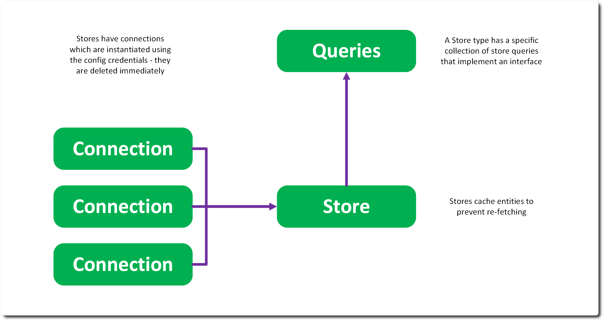
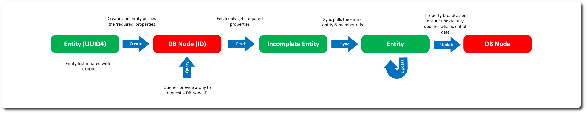
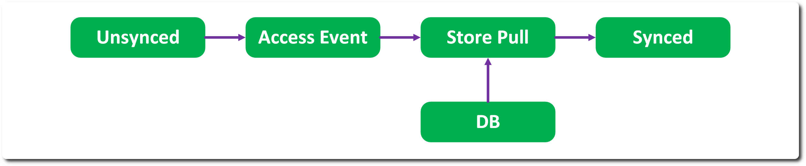

# Stores & Store Names 

Stores are where entities are persistently held. A store is a remote interface that is connected to using the credentials in the config YAML file. In addition, a store name is defined in the config – this is used to partition the store into smaller chunks – allowing you to act upon just test data, or specific data for a show. Entities are stored in a particularly named store and can only interact or connect with other entities in that same named store. 

To implement a store, you are required to derive from the Store class, implement a connection object and satisfy queries. Note that a store isn’t just a database – it could easily be a JSON file. 

## Fetch, Sync & Update 

RMTC uses an adapted CRUD model for working with a store – CREATE, UPDATE, SYNC, FETCH, DELETE. Note that the name READ is reserved for operating on URIs with the IO objects and in RMTC; SYNC performs equivalently to a READ operation. 

An entity is CREATED – any property marked as required is updated in the store system at the same time. Once created the entity holds a ref to the storage system it is replicated in. The UUID4 of the object is used to key for the entity. All member properties are also created at this time. 

If you change a property on an object – the message broadcast system will mark it for UPDATE, on the next push of system it will be sent to the store. All member properties are updated as well. 

You use FETCH to return an entity from an ID – which can be queried using the connection’s various queries. Consider FETCH like read, but only getting the lightest of representations. Store holds an Entity cache, so you are guaranteed to always get the same entity instance for a given ID. 

Once initially fetched it will be a partially constructed object, just the entity and any required properties – you need to call SYNC to read all the properties. 

DELETE is also supported during push, when the entity is marked for delete. This is only possibly in specific Store edit modes. 

## Data Minimisation 

Given AI datasets can be huge – RMTC is very careful to manage how much of it we pull down from a store, so entities are generally partially constructed – you need to SYNC the entity from the store. This is managed via the member and required flags on properties. A required property is always SYNCed, a member property is only SYNCed if the entity that owns it is SYNCed – this keeps the ecosystem of objects pulled from the store small. 

In addition, properties on entities are carefully setup to only point to the minimal set of items required – for example a Run holds a reference back to Solution, Weights holds a reference back to Model. This arrangement ensures that when you SYNC a solution you don’t pull down all the Runs, or if you want to infer with a given Model, it doesn’t pull down 1000s of Weights or Inference instances. 

This arrangement also maps well to our provenance aims – you generally go backwards up the provenance tree; less commonly do you want to go down. 

## JIT Sync 

The store API is built around explicit SYNCing of entities – to allow the client to manage that behaviour. However, it is possible to define a ‘just in time’ syncing strategy that works in tandem with the Object ACCESSED messages to pull a partial entity from the store when accessing a non-required property. 

This is a little inefficient but is highly convenient. 

---
SPDX-License-Identifier: Apache-2.0 - Copyright Contributors to the RMTC Project
