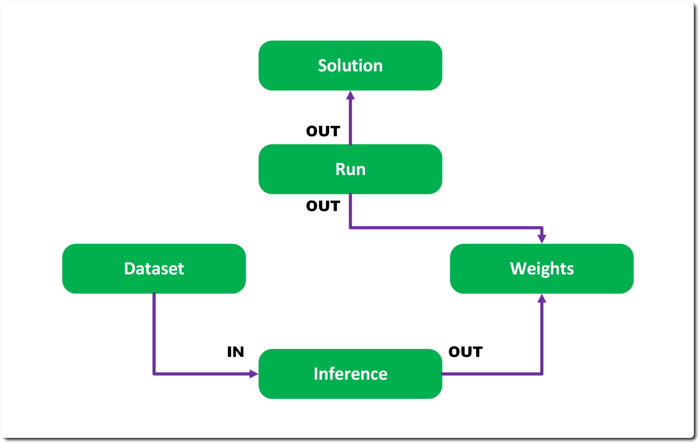

# Track 

Track is the core of RMTC – registering models, querying datasets and storing this data in a remote store. 

## Entity 

An entity in RMTC is a stored object – its properties are duplicated across to the store. A client can create entities and fetch them. An entity monitors its properties so when something is accessed it will sync the remaining properties if not already pulled from the store. If a property is updated, it will flag itself for update later. 

An entity can have its sources and derivatives traced up and down the provenance tree – in which case it will defer to the store if the IN or OUT properties are not immediately available – this may incur a large pull. 

An entity has a named ‘category’ this is used in the Type Name in the factory to determine which class of item to instantiate. This is currently a string – however it should be reduced to an Enum. 

Entities can have basic POD properties added to them – currently Object properties cannot be stored so any additional reference is required to be added in the init of a derived entity. 

## Schema

Entity properties are currently defined within the instances themselves - ideally this would be moved to the YAML definitions and shared for memory efficiency.

The schema is detailed here: [Entity Schema](schema.yaml), with core extensions in [Core Entity Schema](schema_core.yaml)

## Immutability 

Immutability is important to provenance – a dataset or artifact cannot change once ingested, otherwise the provenance information is lost. To augment or tweak entities – additional variants, ancestors or new entities must be created. We have structured the properties so that once created we don’t add or remove elements to that Entity (e.g. a Solution doesn’t have Runs added to it). 

Equally Entities are never deleted and can only be deleted under System modes related to testing. 

## Tracking Independence 

Given RMTC has several audiences it is entirely possible to use the base Tracking Entities without using the inference or training modules. 

This enables researchers to integrate RMTC into their own pipelines and populate the stores using the Tracking portion of the System instance. 

## Provenance 

Provenance is a core feature of tracking and as such there are specific structures to support it – primarily that objects properties have a direction: 

* IN – the property is an input to the object 
* OUT – the property is an output from the object 
* INOUT – the property is both an in and out 

These have various effects – especially when used in relation to Object references in which case input properties are considered sources in the provenance tree; output properties are considered derivations in the provenance tree. 

Since we target specifically a Graph DB as our store – these IN/OUT relationships can be managed directly in the directed connections of the DB.  

Sources and derivations of any given entity can be found through the System object – which traces the structure. 

In the example below Run owns both the OUT properties, Inference own the IN and OUT properties – you can see this ensures the relationships are intuitive, yet we don’t pull extensive amounts of entities when we sync – pull a Dataset and it won’t pull all the Inferences that use it because it has no relationship – it is contained wholly in Inference. 

Direction also dictates where on any DAG style UI the properties appear – left for IN and right for OUT. 

## Tracing & Reports 

Tracing is exposed to a client via System.trace_sources and trace_derivatives, but underneath there’s a small tracing module with a Tracer interface (trace_sources/trace_derivatives, but over asset manager URIs rather than DB entities) and a Report abstraction for turning a trace into an output document. 

MarkdownReport is the concrete implementation – it walks the source or derivative tree for a set of entities, groups the collated results by category and writes it out as a markdown document. This is what powers the Signal Box GUI’s report generation (see GUI, below) and the standalone provenance report example. 

There’s also a Watermarker interface stubbed out for embedding provenance markers directly into published assets (e.g. C2PA) – there’s no working concrete implementation yet, it’s a placeholder for a future guardrail. 

## Filters 

Filters are a small Entity type used to answer yes/no questions about a set of entities – a Filter is callable, taking the entities and returning a bool. 

StackFilter runs a list of filters and fails on the first one that fails (an implicit AND). LogicFilter generalises this with an Operator enum (AND, OR, NAND, NOR, XOR, XNOR) so filters can be composed into arbitrary boolean expressions, and Truth is a fixed pass/fail filter useful as a leaf node in that composition. 

The concrete filters that matter in practice are the license/rights ones – RightsFilter checks that a set of entities’ licenses permit a given set of Rights, and ComplianceFilter checks that a set of licenses are mutually compliant. SolutionCompliant is a convenience that checks compliance against the licenses already in use by an existing Solution. These are what back the permission checks described under Licenses & Guardrails, above. JurisdicationFilter and PartyFilter exist as stubs for future geography/party based restrictions but aren’t implemented yet.

---
SPDX-License-Identifier: Apache-2.0 - Copyright Contributors to the RMTC Project
