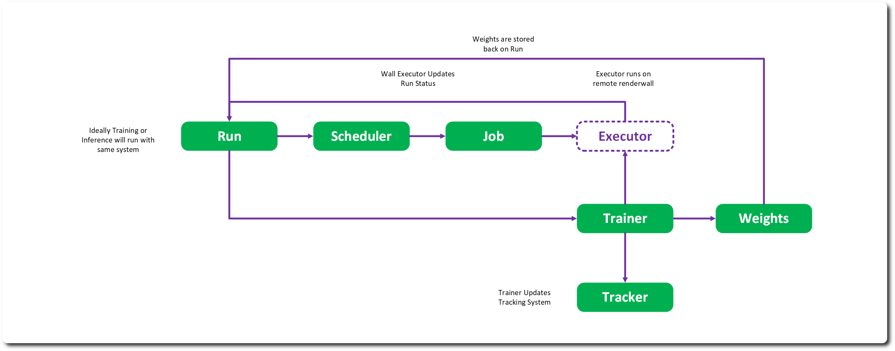

# Train 

Train provides the interface for running a trainer in a Run against a Dataset and Model. This requires the artifacts are correctly wrapped and exposed to the store. 

## Solutions & Runs 

A solution can be considered the ‘project’ in RMTC. It is a solution to a problem – with the runs being attempts to better solve that problem. A solution holds signature information and a path to place runs within.  

Ideally a client would reference the solution rather than a model so that the best run can be dynamically selected – and if a dataset or model is revoked, an alternative can be programmatically found, 

A run holds a reference back to a solution for scalability reasons – it holds the trainer information and the run status. 

## Scheduling 

Runs are not trained directly – they are deferred to a scheduler. Currently this is defined internally to the train module but should be broken out to allow the inference to run with the same architecture. 

Scheduling creates jobs which execute. There are a local implementation and a wall-based solution that is currently implemented with a facility specific system that is not released with the overall RMTC code. This is an ideal first implementation task to support OpenCue for Deadline or something similar. 

## Trainers & Trackers 

The training task itself is deferred to a technology – currently PyTorch and a simple correlated regression trainer. This works directly at the PyTorch level but must follow some basic requirements – the dataset needs to be read, and the resulting assets need to be loaded before converting to input and output model formats. 

Checkpoints are written out at a determined cadence and once complete the trainer returns the resulting weights, model and metrics to the Run for storage. 

The location for the checkpoints and weights is determined relative to the solution and stored in a manner that the trainer decides. 

All the while a deferred tracking system, Tensorboard at present, is used to log various progress information. This is stored again relative to the solution URI. 

## Augmentation 

To support coarse augmentation, the trainer can accept a preprocessor process stack – which adjust the incoming asset tensors. If the trainer is set to repeat – that will revisit the same elements in the dataset but transform them randomly according to the preprocessor, giving a rough chance for augmentation. 

For more complex augmentation – the system defers to the client creating their own rich synthetic datasets.

---
SPDX-License-Identifier: Apache-2.0 - Copyright Contributors to the RMTC Project
